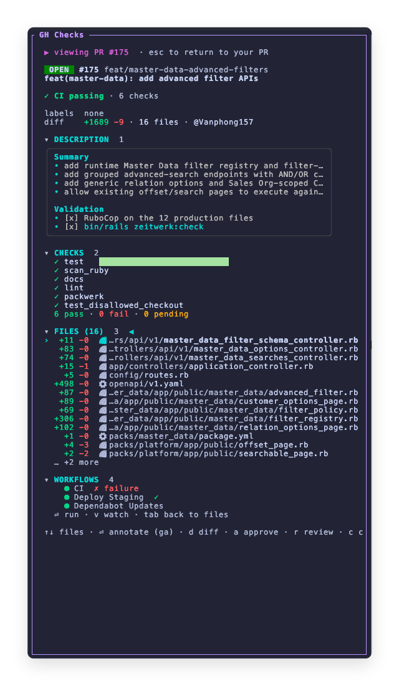

# GH Checks

[](LICENSE)


**Annotate and review the current PR in a [herdr](https://herdr.dev) pane.** Open any changed file side-by-side in `nvim`, press `ga` on a line to capture an exact `path:line` annotation, then send the notes to an agent pane. The pane also shows the PR headline, review decision, per-check progress, description, and changed-file list, refreshed every 5s — with a compact CI/merge status on your sidebar space rows. Built with Go + [Bubble Tea](https://github.com/charmbracelet/bubbletea). Read-only status polling is separated from explicit GitHub mutations (approve, review, workflow dispatch, update-branch, and merge); those actions run through your authenticated `gh` and require the relevant key/confirmation.



## Features

- **Live CI watch** — PR pill, review decision, animated per-check progress, and the changed-file list, polled every 5s until the PR settles.
- **Line-anchored annotations** — open a file side-by-side against base in `nvim`, press `ga` on any line to record a `path:line` note, manage notes with `a`, then press `s` to send the review to an agent pane.
- **Any PR** — press `p` to browse open PRs and review / approve / comment / request-changes without leaving the pane.
- **Workflows** — trigger a GitHub Actions workflow on a branch and watch a run to completion, right in the pane.
- **Merge & update branch** — merge the PR or bring it up to date with base, worktree-aware.
- **Sidebar status** — a colored Nerd Font glyph per space (pass / fail / running / merged / open), animated while CI runs.

## Requirements

- **herdr ≥ 0.7.0** (the plugin system)
- **`gh`** (authenticated: `gh auth status`), **`git`**, and **`nvim`** on your `PATH`
- A **Nerd Font** for the sidebar glyphs
- **macOS or Linux** (amd64 / arm64).
- **Windows**: once a release's digest is present in the reviewed allowlist, `herdr plugin install` downloads the native `.exe` (no Go); until then the safe fallback builds from source and needs Go. The pane shells out to `sh`/`git`/`nvim`, so you need **git-bash / MSYS2 `sh` on `PATH`** for the diff & review features. **WSL is the simplest path** (installs the Linux build, everything just works) and native-Windows launch is not yet verified on real hardware — report issues.
- **Go 1.25.14+** only if building from source — `plugin install` downloads a prebuilt binary only when a matching, allowlisted release asset exists

## Install

From GitHub (downloads a prebuilt binary only after its release asset has been independently verified and its digest added to the reviewed `release-checksums.txt` allowlist; otherwise builds from source):

```bash
herdr plugin install itisbryan/herdr-gh-checks
```

Or link a local checkout for development:

```bash
cd herdr-gh-checks && go build -o herdr-gh-checks . && herdr plugin link .
```

Discoverable through the [Herdr plugin marketplace](https://herdr.dev/plugins/) via the `herdr-plugin` GitHub topic. Marketplace listings are automatic and are not endorsements or security reviews.

## Testing

See [TESTING.md](TESTING.md) for automated checks, the manual acceptance matrix, installer tests, and post-release verification.

## Quick start

Open the pane on a workspace whose cwd is a GitHub repo (or worktree):

```bash
herdr plugin pane open \
  --plugin herdr-gh-checks \
  --entrypoint panel \
  --placement split \
  --direction right
```

### Keybinding

herdr keybindings live in the user's config, not the plugin manifest. Add one to `~/.config/herdr/config.toml` and run `herdr server reload-config`:

```toml
[[keys.command]]
key = "prefix+i"
type = "plugin_action"
command = "herdr-gh-checks.show"   # <plugin_id>.<action_id> — a dot, not a slash
description = "open GH Checks"
```

Then press your prefix (default `ctrl+b`) followed by `i`. Avoid `alt+` chords (they emit characters in the terminal) and keys taken by built-ins.

## Keys

| Key | Action |
| --- | --- |
| `↑↓` · `j` `k` | Move the file cursor |
| `⏎` | Open the selected file for annotation in `nvim` (`ga` annotates a line) |
| `d` | Review all files side-by-side |
| `/` | Filter files |
| `a` · `s` | Manage annotations · send review to an agent |
| `u` · `m` · `o` | Confirm/update branch with base · merge · open on web |
| `p` | Browse & review other PRs (`a` confirm approve · `r` review · `c` comment) |
| `tab` `w` | Focus Workflows — `⏎` choose/confirm run · `v` watch a run |
| `1`–`4` | Fold sections |

## Sidebar setup

For each space, the plugin writes a `ci_<state>` token (`workspace report-metadata --token ci_pass=…`). herdr's packed sidebar only renders tokens you place in your row config, so add the state tokens to `~/.config/herdr/config.toml`, then `herdr server reload-config`:

```toml
[[ui.sidebar.spaces.rows]]
rows = [
  ["state_icon", "workspace",
    {token = "$ci_pass",   fg = "#a6e3a1", bold = true},
    {token = "$ci_fail",   fg = "#f38ba8", bold = true},
    {token = "$ci_run",    fg = "#f9e2af"},
    {token = "$ci_merged", fg = "#cba6f7"},
    {token = "$ci_open",   fg = "#89b4fa"}],
  ["branch", "git_status"],
]
```

Run the status daemon in the background so the tokens stay fresh:

```bash
nohup ./herdr-gh-checks/herdr-gh-checks --sidebar &
```

## Security boundaries

PR titles, descriptions, workflow names, check names, labels, and file paths are untrusted GitHub data. The TUI strips terminal control sequences; repository paths are restricted to regular, repository-relative files, and Neovim is invoked with `--` before filenames. The annotation helper is embedded in the plugin binary rather than loaded from the worktree. Review notes and the cached helper are stored under a private per-user cache directory with mode `0600` (on Windows, the normal per-user profile ACL is used).

The plugin can change GitHub state only through the explicit actions documented above. Approve and update-branch show a confirmation screen; admin merge additionally requires typing `ADMIN`, and a final PR-state check runs immediately before merge. Sending notes is limited to agents in the current `HERDR_WORKSPACE_ID`. API and fetch operations accept only `github.com` remotes; GitHub Enterprise remotes are rejected. For the Git operations used by review, repository-defined hooks, URL rewrites, credential helpers, proxies, and custom upload-pack/SSH settings are intentionally ignored; use a normal authenticated `gh`/SSH setup rather than repository-local transport customization.

Installers do not trust a release's adjacent `.sha256` file. Publishing is deliberately two-stage: the tagged workflow first creates immutable binaries and attestations, then their independently verified digests are added to `release-checksums.txt` in a separate reviewed commit. Until that second stage is complete, installation safely builds from source. When Git metadata is present, a fork or modified checkout also refuses a binary from the canonical upstream owner and builds locally. Release workflow actions are pinned to commit IDs and existing releases are never overwritten. The allowlist is integrity protection, not an independent publisher signature; review the source and release provenance before installing.

For vulnerability reports, see [SECURITY.md](SECURITY.md).

## License

[MIT](LICENSE) © itisbryan
